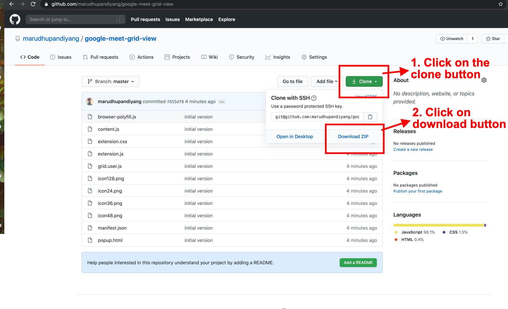
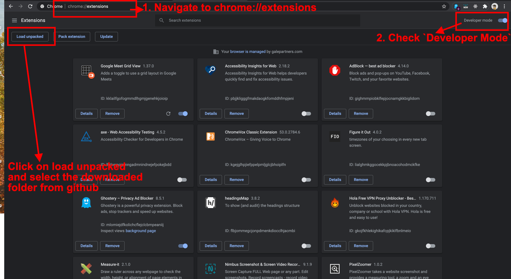
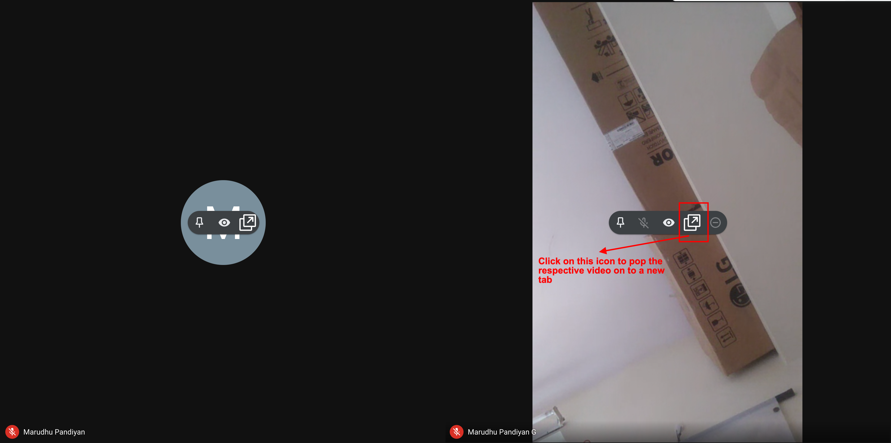
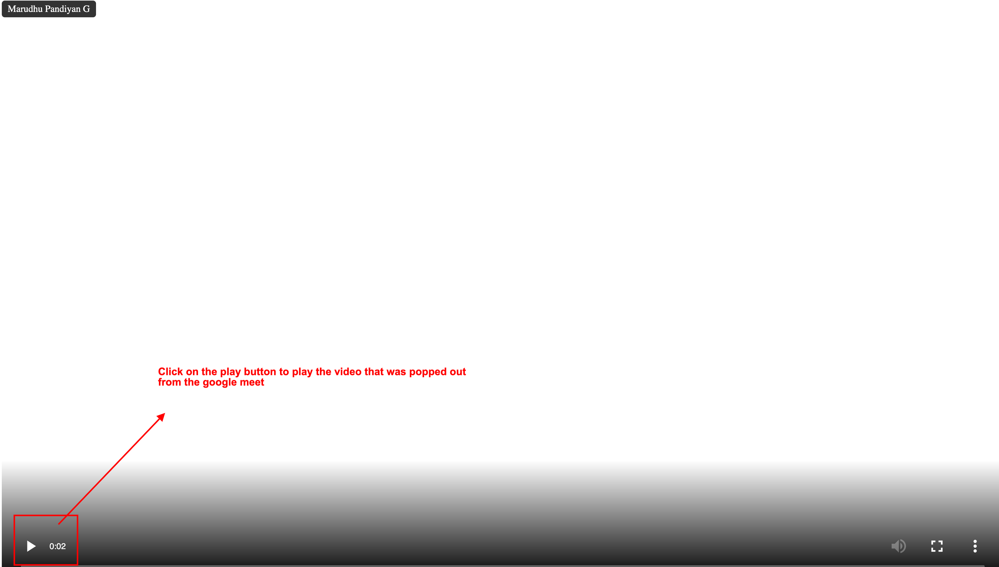

# Google Meet Grid View with Video popout in a new Tab.

## Instructions to Setup
 Note: Instructions are associated with images. check image for more clarity with ordered instructions.

**Note:** Before installing this, please remove the Original `Google Meet Grid View` extension.

1. Download this repo and extract the zip to a folder.

2. Load this extension by checking on the `Developer Mode` in google chrome extension Page(chrome://extensions)
After you load, you should see the new extension in the list.

3. Start a meeting. And click on the highlighted icon to pop the users video out to a new tab

4. On the new tab, click the play button to play the video.

